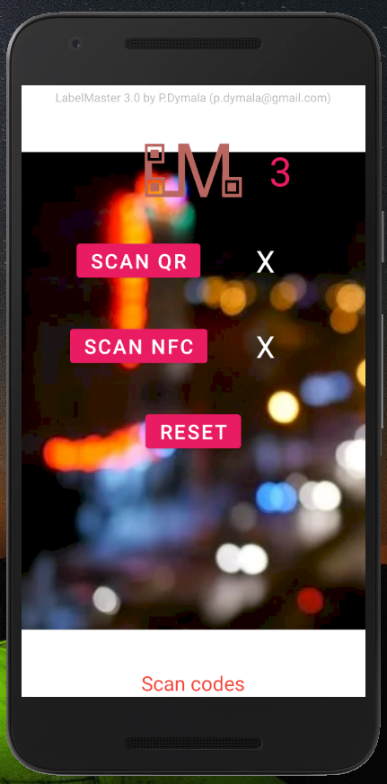
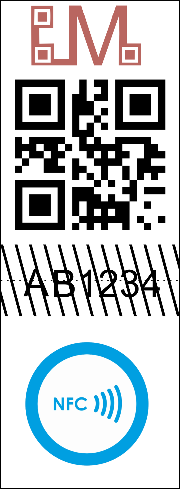

# LabelMaster3.0-Android
Application to check if a label is genuine by comparing printed 2D code with NFC tag content.
  
In order to put your code in the NFC tag, use e.g. NFC Tools. Put the code as simple text
  
UI:

 
A sample label:

NFC reader: modification of https://github.com/jetruby/android-beam-nfc-example   
2D scaning: modification of https://github.com/yuriy-budiyev/code-scanner
